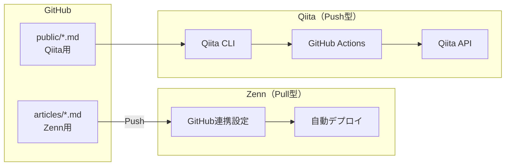

# 自動投稿セットアップ

GitHub を正本にして Zenn と Qiita に自動投稿する仕組み。



| プラットフォーム | 方式 | 仕組み |
|------------------|------|--------|
| **Zenn** | Pull型・同期 | Zenn 側が GitHub リポジトリをチェックし、変更を自動デプロイ |
| **Qiita** | Push型・Actions | GitHub Actions が Qiita CLI を実行し、Qiita API に POST |

---

## Zenn セットアップ

GitHub連携で自動デプロイされます。

### 手順

1. [ZennのGitHub連携設定](https://zenn.dev/zenn/articles/connect-to-github)にアクセス
2. 「GitHubリポジトリと連携する」でリポジトリを選択
3. `articles/` ディレクトリを指定（デフォルト）
4. 連携完了

### 自動デプロイの仕組み

- `main` ブランチへのpush/PRマージをトリガーに自動同期
- `published: true` の記事のみ公開
- `published: false` は下書きとして保存

### CLIコマンド

```bash
# 記事雛形作成
npx zenn new:article

# プレビュー
npx zenn preview
```

---

## Qiita セットアップ

Qiita CLI + GitHub Actionsで自動投稿します。

### 手順

#### 1. Qiitaトークン発行

1. [Qiita設定画面](https://qiita.com/settings/tokens/new)にアクセス
2. 「新しいトークンを発行する」で以下を設定:
   - スコープ: `read_qiita`, `write_qiita`
3. 発行されたトークンをコピー

#### 2. GitHub Secrets設定

1. リポジトリの **Settings** → **Secrets and variables** → **Actions**
2. **New repository secret** で以下を追加:
   - Name: `QIITA_TOKEN`
   - Secret: {発行したトークン}

#### 3. 動作確認

```bash
git push origin main  # Lint成功 → Qiita自動投稿
```

### CIフロー

```
push → Lint → (成功) → Publish to Qiita
```

### CLIコマンド

```bash
# プレビュー
npx qiita preview

# 手動投稿
npx qiita publish
```

---

## 公式リファレンス

- [Zenn: GitHub 連携](https://zenn.dev/zenn/articles/connect-to-github)
- [Zenn: Zenn CLI ガイド](https://zenn.dev/zenn/articles/zenn-cli-guide)
- [Qiita: Qiita CLI](https://qiita.com/Qiita/items/666e190490d0af90a92b)
- [Qiita CLI: GitHub](https://github.com/increments/qiita-cli)
