## はじめに

はじめまして。この記事は私の技術記事執筆デビュー作です！

最初に記事を書くときっていろいろ悩みますよね。私の場合は以下の2点で悩みました。

- 執筆先のプラットフォームどうする？やっぱり昔からあるQiita？いやでも最近はZennの方が良いのか？
- 執筆始めるとして、最初のテーマどうしよう。。

今回このような悩みを一度に解決できる題として、「**「git push」するだけでZennとQiitaに同時投稿される仕組み**」として記事を書くことにしました。

悩むくらいならZennもQiitaもどちらも使ってしまえ！ということですね。最初は面倒ですが、一度仕組み化してしまえはあとは楽ができるので。

この記事では、その構成と実際の手順をまとめています。これから技術ブログを始める人や、既に書いているものの運用を楽にしたい人の参考になれば嬉しいです。

## やりたいこと

- 使い慣れたエディタやターミナルでZenn/Qiitaの記事執筆をする
- `git push` するだけで、ZennとQiitaに同時投稿される
- 記事の修正もGitHub側で行い、各プラットフォームへ自動反映する

## 全体像

全体イメージはこんな感じです。

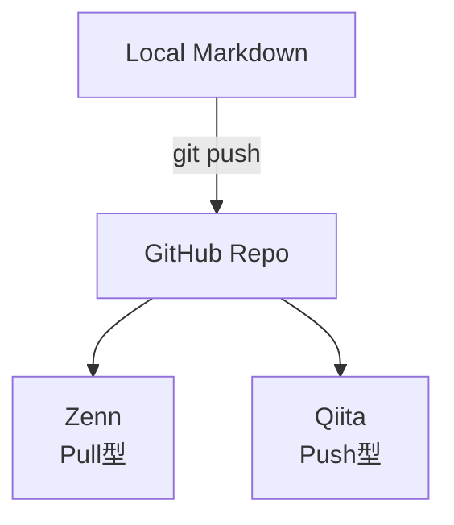

**ちょっと面白いのが、ZennとQiitaでGithub連携の仕組みがpull型 / push型と反対な点です。**

- **Zenn**: GitHub側の変更をZennが定期的に取りに来る（Pull型）「 = プラットフォームが見に来る」
- **Qiita**: GitHub Actionsがトリガーされて、Qiitaへ投稿しに行く（Push型）「 = CIでプラットフォームに押し込みに行く」

## ディレクトリ構成

記事の管理はこんな感じで分けています。

```text
article-repo/
├── articles/        # Zenn用（Zennがここを見る）
├── public/          # Qiita用（Qiita CLIがここを見る）
├── images/          # 共用画像
└── .github/
    └── workflows/
        └── qiita-publish.yml  # Qiita自動投稿用Actions
```

ZennとQiitaでFront Matterの形式が違うので、最初は別ファイル運用にしています。

## 手順

では実際に手順を追っていきます。

### 1. GitHubリポジトリを作成

好きな名前でリポジトリを作成します。私は `article` という名前にしました。

publicでもprivateでもどちらでも構いません。READMEなどのいったんすべて不要でOKです。

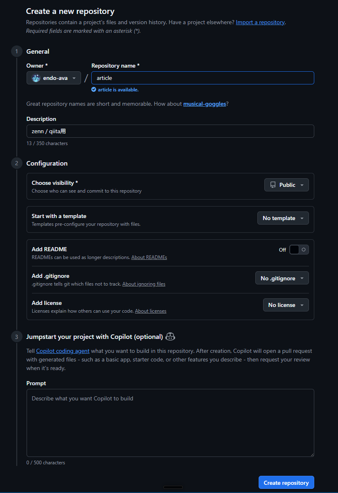

### 2. Zenn の作業

Zennは公式でGitHub連携を提供しているので、設定はとてもシンプルです。

#### 2.1. ZennでGitHub連携を設定

Zennの設定画面から「GitHub連携」-> 「リポジトリを連携する」を選択します

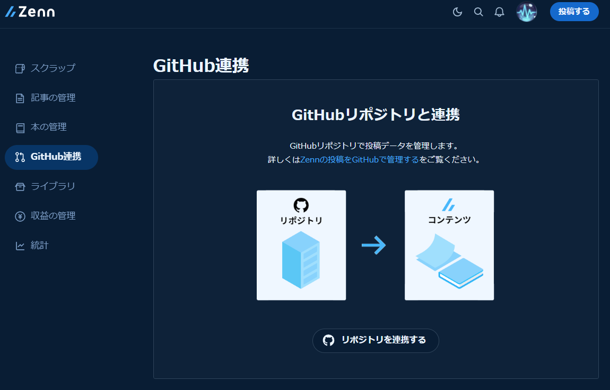

「Only select repositories」-> 連携したいリポジトリ を選択し、「Install & Authrize」。

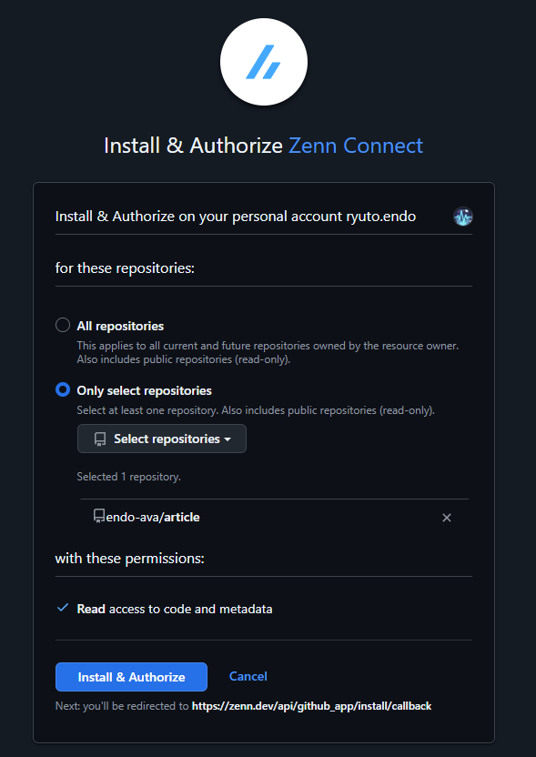

> **補足**: Zenn CLIというツールもありますが、今回はWeb設定のみで完結するので使用してません。また、Zennは**連携できるリポジトリが最大2つ**という制約がります。

Zennの作業はこれで終了です。

### 3. Qiita の作業

QiitaはGitHub連携が提供されていないので、Qiita CLIとGitHub Actionsを組み合わせて実現します。

### 3.1: アクセストークンを発行

Qiitaの設定画面から「アプリケーション」-> 「新しくトークンを発行する」を選択します。

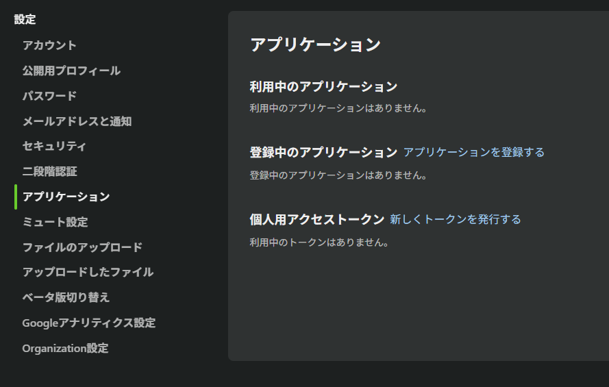

必要な権限（read_qiita、write_qiita）を付与して発行します。アクセストークンの説明は自分が分かれば何でもよいです。

発行したトークンは再表示できないため大切に保管します。

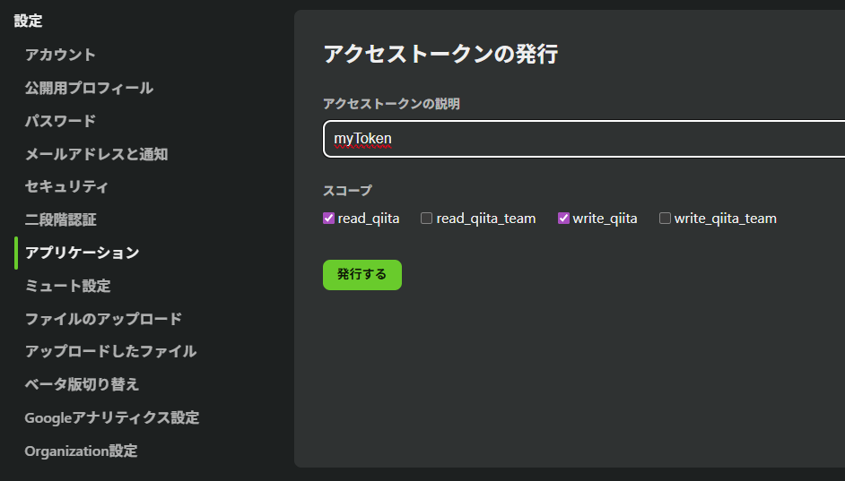

### 3.2. GitHub Secretsにトークンを登録

連携したいリポジトリのSettings → Secrets and variables → Actions から、`QIITA_TOKEN` という名前で、前述で発行したトークンを登録します。

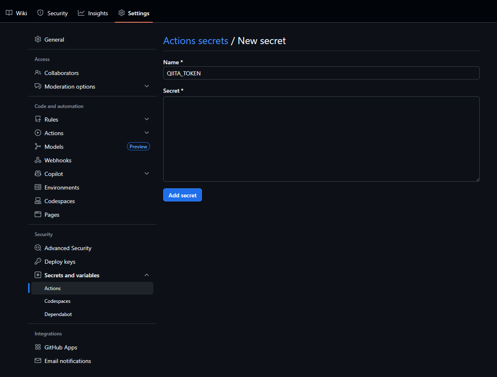

### 3.3. GitHub Actionsの設定

連携したいリポジトリで、`.github/workflows/publish-qiita.yml` を作成します。

これにより、mainブランチにpushされたとき、Qiita CLIによって記事が自動投稿されます。

#### publish-qiita.yml

```yaml
name: Publish to Qiita

on:
  push:
    branches: [main]
  workflow_dispatch:

permissions:
  contents: write

concurrency:
  group: ${{ github.workflow }}-${{ github.ref }}
  cancel-in-progress: false

jobs:
  publish:
    runs-on: ubuntu-latest
    steps:
      - uses: actions/checkout@v4
        with:
          fetch-depth: 0

      - uses: increments/qiita-cli/actions/publish@main
        with:
          qiita-token: ${{ secrets.QIITA_TOKEN }}
          root: "."
          commit-message: "Updated by qiita-cli"
```

これでQiitaの自動投稿設定も完了です。

## 4. 記事を作成

Zenn用とQiita用、それぞれのディレクトリに記事を作成します。

Zenn用 -> `articles/*.md`

Qiita用 -> `public/*.md`

### 注意1: YAML FrontMatterの設定について

Zenn / Qiitaの記事として認識させるには、それぞれ以下のようなFrontMatterをマークダウンの上部に記載する必要があります。

### Zenn（`articles/*.md`）

```yaml
---
title: "記事タイトル"
emoji: "🔥"           # 絵文字（1文字）
type: "tech"          # tech / idea
topics:               # タグ（配列, 全て小文字）
  - ai
  - github              
published: true       # true: 公開 / false: 下書き
published_at: 2050-06-12 09:03  # 予約公開（任意）
---
```

### Qiita（`public/*.md`）

```yaml
---
title: "記事タイトル"
tags:                 # タグ（配列, 全て小文字の制約はない）
  - AI
  - GitHub
private: false        # false: 公開 / true: 限定共有
updated_at: ""        # 投稿時に自動入力
id: null              # 投稿時にUUIDが自動入力
organization_url_name: null
slide: false
ignorePublish: false  # trueでpublish対象外
---
```

### 5. pushして投稿

```bash
git add .
git commit -m "初めての記事"
git push
```

mainブランチにて「`git push`」することで、Zenn / Qiita の自動投稿が行われます。

少し待つと、

Zennでテスト記事投稿成功🎉

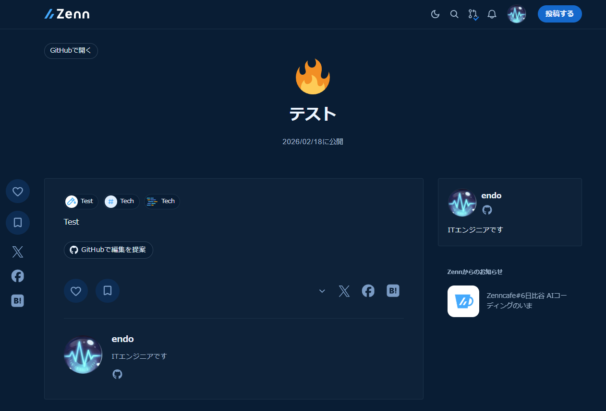

Qiitaでテスト記事投稿成功🎉

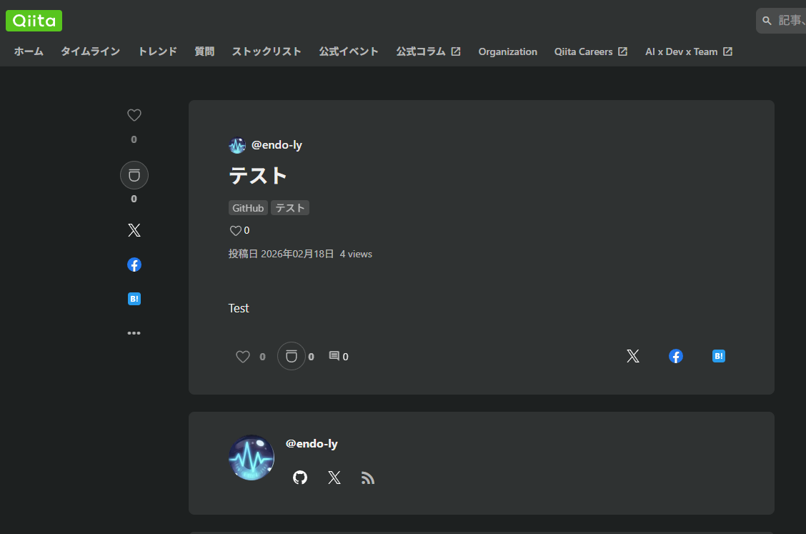

補足として、Zenn側でデプロイが成功すると、通知が来ます。

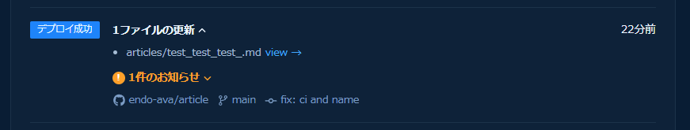

また、Qiita側では、CIによりQiitaCLIが以下のようなコミットを発行してきます。

主にFront Matterの自動設定コミットで、UUIDなどが自動で付与されます。

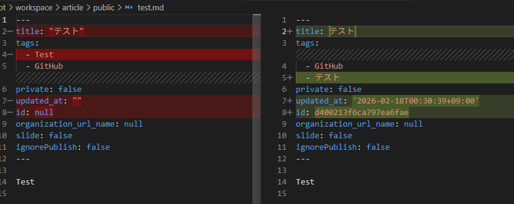

### 注意2: 記事ファイル名の注意点

Zennにはファイル名の制約があるので注意が必要です。

**Zenn**:

- 半角英数字（a-z0-9）、ハイフン（-）、アンダースコア（_）の12〜50文字の組み合わせにする必要があります
- 12文字と結構多いため注意

**Qiita**:

- 初回時の制約はないので、Zennに合わせると管理しやすいです
- mainにpushすると、Qiita CLIによって自動で `<UUID>.md` に変更されます

## LINTチェック

Node環境があればついでに以下のような静的解析ツール系を入れるのもよいです。（もちろん無くてもよいです）

私の場合はとりあえず以下の2つを入れてみました。

- markdownlint: マークダウンの構文チェック
- markdown-link-check: マークダウン内のリンクチェック

実はtextlintという文章の自動校正などをしてくれるツールも入れてみたのですが、私は合わなかったので消しました。場合によってはあえて崩したいときもあるでしょうし、いろいろ融通利かないので。

### package.json

```json
{
  "name": "article",
  "version": "1.0.0",
  "description": "External article writing repository",
  "scripts": {
    "lint": "npm run lint:md",
    "lint:md": "markdownlint \"articles/**/*.md\" \"public/**/*.md\"",
    "lint:links": "sh -c 'find articles public -name \"*.md\" -exec markdown-link-check --config .linkcheck.json {} +'",
    "lint:fix": "npm run lint:md -- --fix",
    "prepare": "husky"
  },
  "lint-staged": {
    "{articles,public}/**/*.md": [
      "markdownlint --fix"
    ]
  },
  "devDependencies": {
    "husky": "^9.1.7",
    "lint-staged": "^16.2.7",
    "markdown-link-check": "^3.14.2",
    "markdownlint-cli": "^0.47.0",
  }
}

```

## 記事の削除について

「正本はGitHub」と言いつつ、実は削除に関してはWeb側での操作が必要です。

- GitHubでMarkdownを削除しても、Zenn/Qiita上の記事は削除されない
- Web側のダッシュボードから削除操作が必要

とりあえず記事削除したい場合はGithub / Webどちらからも削除しておきましょう。
Githubから削除したくない場合は`draft/`などの別ディレクトリに逃がしておくのもよいです。

## おわりに

今回はGitHubを正本にしてZennとQiitaに自動投稿する仕組みを整えました。

この手の自動化作業って最初はだいぶ面倒なんですが、一度整えてしまえばあとは楽に管理できるので私は好きです。

自動化大好き人間はこういう作業そのものが好きみたいなところもありますが笑

ちなみに、今回の自動化を発展させると、

- ローカルとGithubで記事の執筆と投稿ができる

  - -> AIエージェント（とくにCLI系）で記事執筆ができる

    - -> エディタすら開くことなく執筆できる

      - -> AIエージェントに「XXについての記事執筆して」と投げるだけで投稿まで自動化できる

というレベルまでできてしまいます。（やるかどうかは別ですが）

AIって自動化の幅を大幅拡張してくれるので楽しいですよね。

### 初投稿を終えて

記事書くの最初はだいぶ億劫だったが始めてしまえば意外と筆が乗る。
